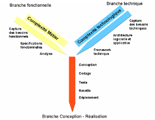
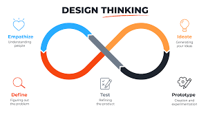

# Processus de développement

1. **2TUP :**

2TUP est un processus de développement logiciel qui implémente le Processus Unifié. Il commence par une étude préliminaire qui consiste essentiellement à :
   - identifier les acteurs qui vont interagir avec le système à construire
   - établir un cahier des charges 

Le processus s'articule ensuite autour de 3 phases essentielles :
   - une branche technique
   - une branche fonctionnelle
   - une phase de réalisation

**Branche fonctionnelle**: qui consiste en la modélisation et le maquettage pour clarifier les besoins fonctionnels.

**Branche Technique** : qui recense toutes les contraintes à respecter pour réaliser le système. Elle définit ensuite les composants nécessaires à la construction de l’architecture technique.

**La phase de réalisation** : consiste à réunir les deux branches, permettant de mener une conception applicative et enfin la livraison d'une solution adaptée aux besoins. Arrive par la suite l’étape de codage et enfin l’étape de recette, qui consiste à valider les fonctions du système développé.

{:width="70%"} *Figure: 2TUP*

2. **Design thinking :**

Le **design thinking** est une approche de l'innovation centrée sur l'humain. C'est une méthode ou un processus de conception globale, centré sur l'utilisateur (ou l'humain), en vue de réaliser des services ou produits innovants.

{:width="70%"} *Figure: diagramme de classe globale*

<!-- new slide -->
