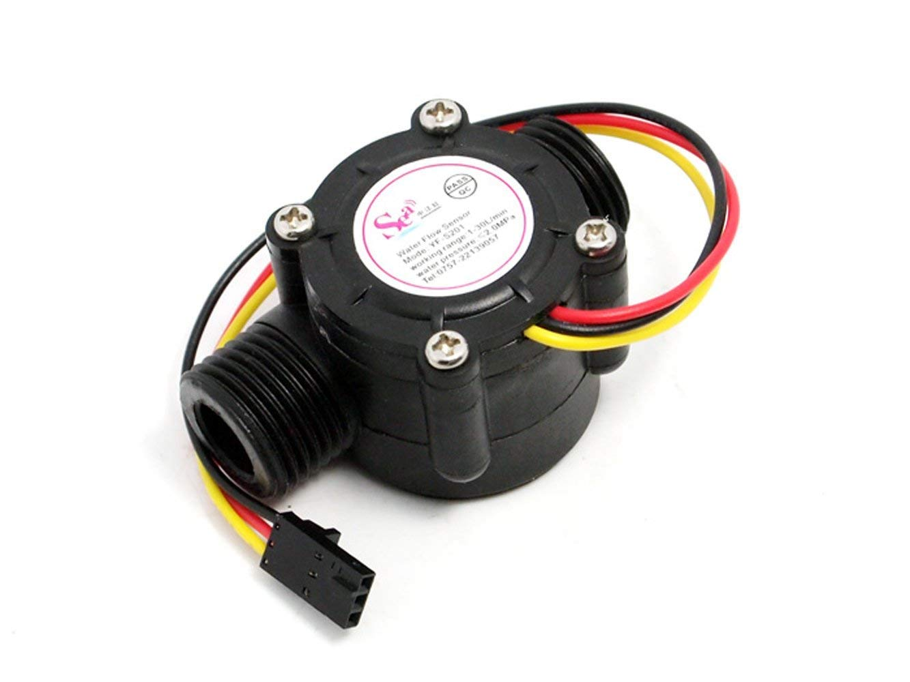
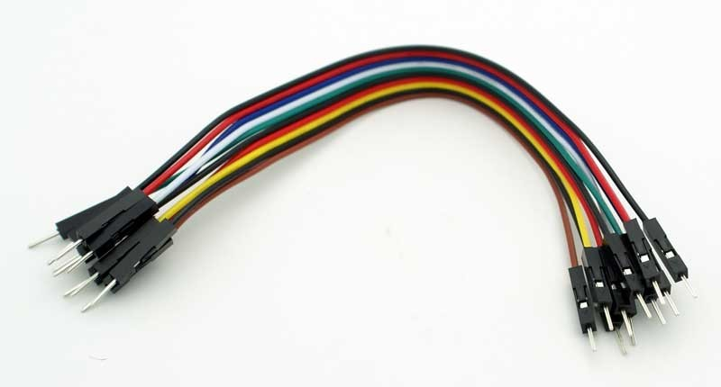
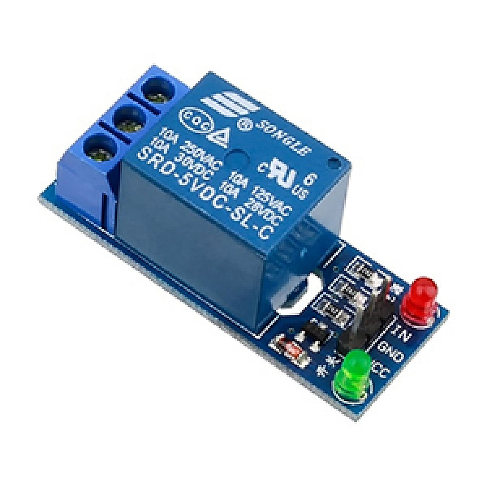

# Analyse Techniques
{:class="sectionHeader"}

<!-- new slide -->

### Adruino

{:width="900px"}*figure: Adruino*

### Water flow sensor YF-S201 

{:width="900px"}*figure: Water flow sensor YF-S201*

### Jumper wires

{:width="900px"}*figure: Jumper wires*

### Relay module

{:width="900px"}*figure: ConcRelay module (to control the water flow)lusion*

### Laravel