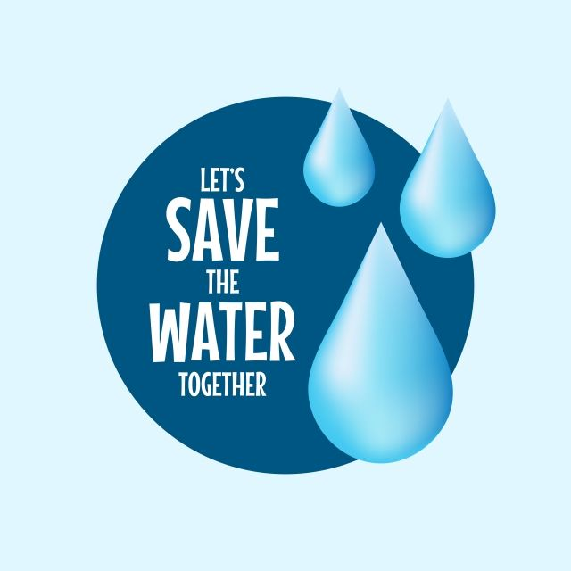

# Besoin

<!-- new slide -->

## Context de projet

{:width="50%"}*figure: Introduction*

<!-- note -->

Le contexte de notre projet repose sur la prise de conscience croissante des défis liés à la gestion de la consommation d'eau domestique. Nous observons une préoccupation grandissante quant au gaspillage d'eau, aux coûts associés et à l'impact environnemental de cette ressource précieuse. Dans ce contexte, notre projet vise à proposer une solution innovante et centrée sur l'utilisateur pour aider les individus et les ménages à mieux comprendre, surveiller et gérer leur consommation d'eau.

## Empathie

<!-- note -->
Ce qu'il fait :

**Entretiens approfondis :** Il mène des entretiens approfondis avec différents utilisateurs pour comprendre leurs besoins, leurs défis et leurs préoccupations en matière de consommation d'eau domestique.

**Observation active :** Il observe attentivement les comportements des utilisateurs liés à leur consommation d'eau, notant les habitudes et les schémas récurrents.

**Collecte d'insights :** Il synthétise les données recueillies lors des entretiens et de l'observation pour identifier les principaux insights sur les besoins et les défis des utilisateurs.

Ce qu'il dit :

**Conscience des utilisateurs :** Il souligne que de nombreux utilisateurs sont conscients de l'importance de la conservation de l'eau, mais qu'ils ont du mal à estimer leur propre consommation.

**Préoccupations environnementales :** Il met en avant les préoccupations des utilisateurs concernant le gaspillage d'eau et leur désir de contribuer à la conservation de l'eau.

**Difficultés spécifiques :** Il mentionne les difficultés rencontrées par certains utilisateurs pour détecter les fuites dans leur système de plomberie, ainsi que leur manque de compréhension sur la relation entre leur consommation d'eau et les coûts associés.

## Définition du Problème

nous pourrions constater que les utilisateurs ont du mal à surveiller leur consommation d'eau de manière efficace et à prendre des mesures pour réduire leur empreinte hydrique. Le problème à résoudre pourrait alors être défini comme suit : comment aider les utilisateurs à surveiller et à gérer leur consommation d'eau de manière plus proactive et efficace ?

## Idéation

Notre solution repose sur deux piliers principaux : l'utilisation d'Arduino et de Laravel.

**Arduino :** Nous avons intégré des capteurs de débit d'eau à des cartes Arduino pour mesurer précisément la consommation d'eau dans différents contextes, tels que la douche et la vaisselle. Cette technologie permet une surveillance en temps réel et une collecte de données précises sur la consommation d'eau.

**Laravel :** Nous avons développé une application web robuste avec Laravel pour stocker, analyser et présenter les données de consommation d'eau de manière conviviale pour les utilisateurs. Cette plateforme offre une interface intuitive pour surveiller la consommation, définir des objectifs personnalisés et recevoir des alertes en cas de dépassement des limites définies.
<!-- new slide -->
