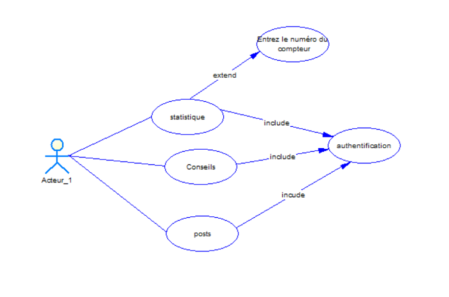

# Diagramme de cas d'utilisation 

L'utilisation du diagramme de cas d'utilisation simplifie la clarification et l'organisation des besoins en offrant une représentation visuelle des interactions entre les utilisateurs et le système. Cette approche facilite la conception d'une solution logicielle répondant de manière précise et efficace aux besoins identifiés.
{:class="introduction"}

{: width="900px" }*Figure : Cas d'utilisation*

<!-- new slide -->